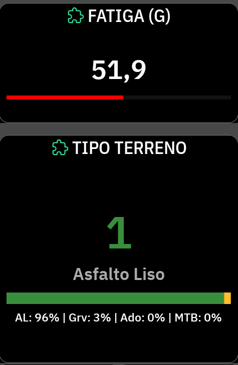

# GravelShock

<p align="center">
  
</p>

**GravelShock** es una extensión para dispositivos **Karoo (Hammerhead)** que analiza y clasifica la rugosidad del terreno en tiempo real mediante el acelerómetro integrado del ciclocomputador. 

Ideal para ciclistas de Gravel, MTB o carretera que quieran monitorizar por dónde están rodando y cómo afecta el terreno a la bicicleta.

---

## Características (v0.0.5)

* **Clasificación en Vivo del Terreno**: Diferencia de forma inteligente entre **Asfalto Liso**, **Gravel / Pista**, **Adoquines** y **MTB / Terreno Roto**.
* **Medidor de Fatiga (G)**: Calcula la acumulación de fatiga y estrés por vibraciones en tiempo real para que sepas cuándo bajar la presión de los neumáticos o tomarte un respiro.
* **Barra de Porcentajes Dinámica**: Una espectacular barra de colores dinámica que te muestra gráficamente el porcentaje de la ruta que has hecho por cada tipo de terreno.
* **Interfaz de Datos a Medida**: Diseño renovado para aprovechar al máximo el layout visual del Karoo con colores Material Design de alta intensidad.

## Captura de Pantalla



## Instalación

1. Descarga el archivo `GravelShock-release.apk` más reciente desde la sección **Releases**.
2. Conecta tu Karoo al ordenador por USB y asegúrate de tener habilitada la **Depuración USB** (Opciones de desarrollador).
3. Instala la extensión mediante ADB (Android Debug Bridge):
   ```bash
   adb install GravelShock-release.apk
   ```
4. En tu Karoo, entra en tu perfil de ruta y añade las nuevas páginas/campos de datos de **GravelShock**.

## ¿Cómo funciona?

La aplicación lee los valores del sensor `TYPE_ACCELEROMETER` del propio dispositivo a 50Hz. A través de un algoritmo de promediado de ventana, GravelShock neutraliza los baches aislados para ofrecer una estimación realista y sostenida de la textura del suelo. Las vibraciones continuadas se acumulan en un índice de fatiga general del ciclista.

---
*Diseñado para Karoo 3 (SDK 35).*
