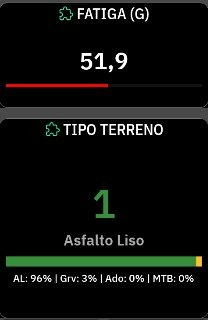

# GravelShock

<p align="center">
  
</p>

[🇪🇸 Español](#español) | [🇬🇧 English](#english)

---

<a name="español"></a>
## 🇪🇸 Español

**GravelShock** es una extensión para dispositivos **Karoo (Hammerhead)** que analiza y clasifica la rugosidad del terreno en tiempo real mediante el acelerómetro integrado del ciclocomputador. 

Ideal para ciclistas de Gravel, MTB o carretera que quieran monitorizar por dónde están rodando y cómo afecta el terreno a la bicicleta.

<p align="center">
  
</p>

### Características (v0.0.5)

* **Clasificación en Vivo del Terreno**: Diferencia de forma inteligente entre **Asfalto Liso**, **Gravel / Pista**, **Adoquines** y **MTB / Terreno Roto**.
* **Medidor de Fatiga (G)**: Calcula la acumulación de fatiga y estrés por vibraciones en tiempo real para que sepas cuándo bajar la presión de los neumáticos o tomarte un respiro.
* **Barra de Porcentajes Dinámica**: Una espectacular barra de colores dinámica que te muestra gráficamente el porcentaje de la ruta que has hecho por cada tipo de terreno.
* **Interfaz de Datos a Medida**: Diseño renovado para aprovechar al máximo el layout visual del Karoo con colores Material Design de alta intensidad.
* **Soporte Bilingüe**: La app detecta el idioma del dispositivo y se adapta (Español o Inglés).

### Instalación

1. Descarga el archivo `GravelShock-release.apk` más reciente desde la sección **Releases**.
2. Conecta tu Karoo al ordenador por USB y asegúrate de tener habilitada la **Depuración USB** (Opciones de desarrollador).
3. Instala la extensión mediante ADB:
   ```bash
   adb install GravelShock-release.apk
   ```

### 🤝 Créditos y Agradecimientos
* Construido sobre el SDK oficial [karoo-ext](https://github.com/hammerheadnav/karoo-ext) de Hammerhead (Licencia Apache 2.0).
* Inspirado por la comunidad open-source de modding para Karoo (como la mítica extensión *Ki2* o *Climber+*).
* Desarrollado por **David García Pascual**.

### 📄 Licencia y Descargo de Responsabilidad
Este proyecto de código abierto se distribuye bajo la licencia **MIT** - Copyright 2026 David García Pascual. *Descargo de responsabilidad: Esta extensión no está afiliada, respaldada, patrocinada ni soportada por Hammerhead o SRAM. Úsala bajo tu propio riesgo y, por favor, mantén siempre los ojos en la carretera y las manos en el manillar.*

### ☕ Apoya el proyecto
Si esta extensión te ha resultado útil y quieres apoyar su continuo desarrollo:

<a href="https://www.buymeacoffee.com/DAVOE75" target="_blank"></a>

---

<a name="english"></a>
## 🇬🇧 English

**GravelShock** is an extension for **Karoo (Hammerhead)** devices that analyzes and classifies terrain roughness in real-time using the bike computer's built-in accelerometer.

Perfect for Gravel, MTB, or Road cyclists who want to track the type of terrain they are riding on and how it impacts their bike.

<p align="center">
  
</p>

### Features (v0.0.5)

* **Live Terrain Classification**: Intelligently differentiates between **Smooth Tarmac**, **Gravel**, **Cobbles**, and **MTB / Rough Terrain**.
* **Fatigue Meter (G)**: Calculates the accumulation of stress and fatigue from vibrations in real-time, letting you know when to lower tire pressure or take a break.
* **Dynamic Percentage Bar**: A spectacular dynamic color bar that visually shows the percentage of your ride spent on each terrain type.
* **Custom Data Interface**: Completely redesigned to maximize Karoo's visual layout, featuring high-intensity Material Design colors.
* **Bilingual Support**: The app automatically detects your device's language and adapts to it (English or Spanish).

### Installation

1. Download the latest `GravelShock-release.apk` file from the **Releases** section.
2. Connect your Karoo to your computer via USB and ensure **USB Debugging** is enabled (Developer options).
3. Install the extension using ADB:
   ```bash
   adb install GravelShock-release.apk
   ```

### 🤝 Credits and Acknowledgments
* Built on the official Hammerhead [karoo-ext](https://github.com/hammerheadnav/karoo-ext) SDK (Apache 2.0 License).
* Inspired by the open-source modding community for Karoo (like the legendary *Ki2* or *Climber+* extensions).
* Developed by **David García Pascual**.

### 📄 License and Disclaimer
This open-source project is distributed under the **MIT** license - Copyright 2026 David García Pascual. *Disclaimer: This extension is not affiliated with, endorsed, sponsored, or supported by Hammerhead or SRAM. Use it at your own risk and please always keep your eyes on the road and your hands on the handlebars.*

### ☕ Support the project
If you found this extension useful and want to support its continuous development:

<a href="https://www.buymeacoffee.com/DAVOE75" target="_blank"></a>

---
*Designed for Karoo 3 (SDK 35).*
